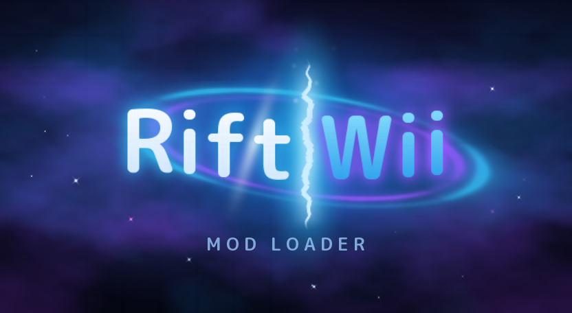
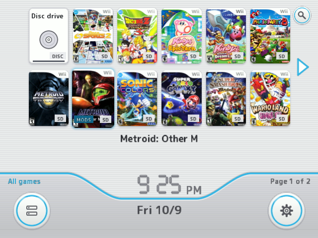
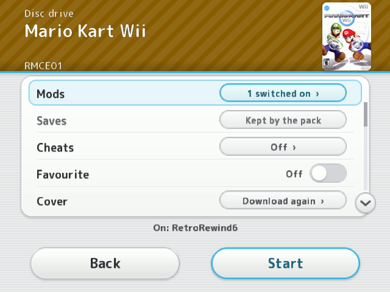
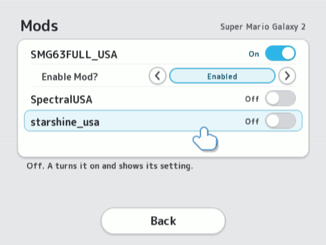
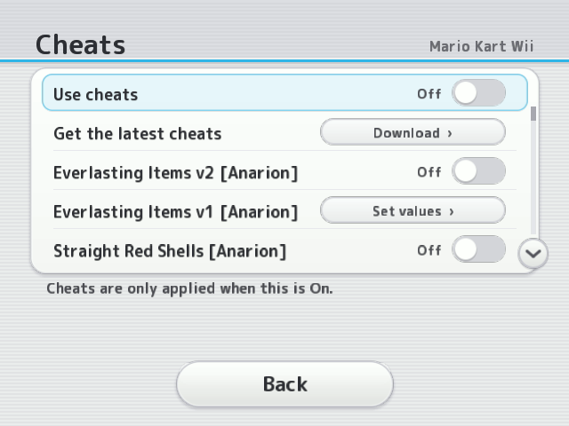
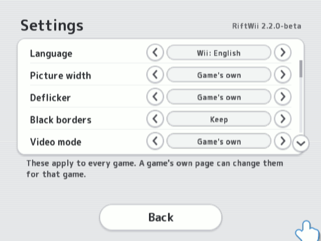
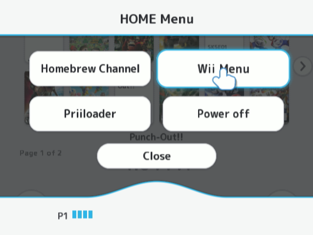

  

  <b>A mod loader for the Wii.</b> Play Riivolution-format mods from the disc, a USB drive or the SD card.
    
  <a href="https://github.com/KakarottoCake/Riftwii/releases/latest"><b>Download</b></a> ·
  <a href="docs/GUIDE.md">Guide</a> ·
  <a href="docs/GUIDE.md#troubleshooting">Troubleshooting</a> ·
  <a href="https://github.com/KakarottoCake/Riftwii/issues">Report a problem</a> ·
  <a href="https://discord.gg/gGsTdjjQaK">Discord</a>

<table>
  <tr>
    <td width="50%"> 
Your games, with covers
</td>
    <td width="50%"> 
Each game's own settings
</td>
  </tr>
  <tr>
    <td> 
Turn mod packs on and pick their options
</td>
    <td> 
Cheats, downloaded for you
</td>
  </tr>
  <tr>
    <td> 
Settings
</td>
    <td> 
A HOME Menu, like the Wii's
</td>
  </tr>
</table>

## Features

- **Mods, no patching.** Riivolution-format packs (the same XML and folders) load into the game as it starts. Your game files are never changed.
- **Play from anywhere.** The disc, a USB drive (FAT32, NTFS or formatted as WBFS) or the SD card, as WBFS, ISO or Dolphin's RVZ.
- **Big mods work.** Pulsar and CT-CODE packs such as CTGP and other Mario Kart Wii distributions, plus packs over the network from a PC (RiiFS), and Gecko code builds like Project+ and REX without their launchers.
- **Saves kept apart.** Modded saves can live on the SD card, away from your Wii saves.
- **Per game settings.** Cheats (downloaded for you), picture width, deflicker, borders, video mode (480p, PAL 60), game language and cIOS.
- **Online play.** Wiimmfi, WiiLink WFC, AltWFC or your own server.
- **Feels like a Wii.** Covers and names from GameTDB, favourites, recently played, an A to Z jump, a HOME Menu and five languages.
- **Any controller.** Wii Remote, Classic Controller, GameCube controller, the GameCube adapter for Wii U, and USB pads through fakemote.
- **A Wii Menu channel**, on a Wii or a Wii U, and **updates** from inside RiftWii (Stable or Beta).
- **Experimental:** burned Wii discs, in the Wii's drive or a USB DVD drive.

## Getting started

You need a Wii (or a Wii U in Wii mode) with the Homebrew Channel and a FAT32 SD card. Games on USB or SD need a [d2x cIOS](docs/GUIDE.md#what-you-need).

1. Download the zip from [Releases](https://github.com/KakarottoCake/Riftwii/releases/latest).
2. Copy its `sd-card` folder to your SD card (and `usb-drive` to your USB drive, if you use one).
3. Put mod packs in `sd:/riivolution` and games in `wbfs` or `games`.
4. Start RiftWii from the Homebrew Channel.

Questions, test builds and help are on the [RiftWii Discord](https://discord.gg/gGsTdjjQaK). The [guide](docs/GUIDE.md) covers everything else: each screen, online play, the GameCube adapter, writing packs, and what to send when something goes wrong.

## About AI assistance

Yes, RiftWii was written with AI assistance, and I won't pretend
otherwise. But it was not vibecoded. Every step was supervised closely,
because even the best models make terrible calls when you just throw
them at a project and walk away. Left alone, they suggested "fixes" like
patching discs at random based on assembly fingerprints to make a
problem go away, and seemed to think that was fine. I can't imagine what
a truly vibecoded version of this would look like. The design decisions,
the testing on real hardware and the refusal to ship shortcuts like that
are mine.

This is a hobby project. As a kid I wanted to play mods straight from a
USB drive, and Riivolution never allowed it; its developer was firmly
against USB loading. RiftWii exists to finally get past that.

## Credits

RiftWii stands on a lot of other people's work. Code that follows or
contains theirs names them in its file header, and
[NOTICE.md](NOTICE.md) lists each piece: what it is, where it came from
(with the commit), and its licence.

- **USB Loader GX** (https://github.com/wiidev/usbloadergx, GPL-3.0):
  the online server patches (`PrivateServerPatcher`, `domainpatcher`),
  the Wiimmfi patches and Mario Kart Wii security fix, the
  return-to-channel patch, the language patch, the video mode tables,
  and RiftWii's copy of the Gecko code handler. Thanks to its developers
  and everyone whose work it carries: ToadKing (wiilauncher-nossl),
  Leseratte and the Wiimmfi team, giantpune, Nuke and the GeckoOS
  authors.
- **Gecko OS** by Nuke, brkirch, Link and the Gecko authors: the cheat
  code handler (full source in [vendor-gecko](vendor-gecko)).
- **Brainslug** by Alex Chadwick and Florian Bach (MIT): the boot
  sequence. **wup-028-bslug** by Alex Chadwick (MIT): the GameCube
  controller adapter.
- **Nintendont** by FIX94 and contributors: the USB HID driver, used
  with its developers' permission. **WiiDRC** by FIX94: the Wii U
  GamePad.
- **libwiigui** by Tantric, **FreeTypeGX** by Armin Tamzarian,
  **oggplayer** by Hermes: the menu's toolkit, text and music player.
- **WiiLink WFC** (wfc-patcher-wii): WiiLink online play.
- **d2x cIOS**: the USB and SD game loading interface.
- **devkitPro and libogc** (Michael Wiedenbauer, Dave Murphy, Hector
  Martin, Sven Peter and others): the toolchain and the Wii library.
- **Dolphin**, **wiibrew** and the **Riivolution patch format wiki**:
  how the Wii and the patch format behave (read as documentation).
- **pugixml** by Arseny Kapoulkine, **Zstandard** by Meta, **BearSSL**
  by Thomas Pornin, **FreeType**, **zlib**, **brotli**, **Tremor**.
- **GameTDB** for game names and covers, **RiiConnect24** for the cheat
  archive, **M+ Fonts** for the menu font, **Zane Little** for the menu
  music.

## Licence

GPL-3.0-or-later ([LICENSE](LICENSE)). RiftWii contains no Riivolution
code. Its third-party components, their origins and licences are in
[NOTICE.md](NOTICE.md). Each release zip carries `LICENSE.txt`,
`NOTICE.md` and `SOURCE.txt` (which commit of this repository it was
built from), and RiftWii shows its licence and credits in Settings >
Credits and licence.

### A note for the licence enthusiasts

Good news: RiftWii follows the GPL to the letter, and then some. For
anyone who needs it spelled out:

- Every file that follows someone else's work says so at the top, with
  the project, the file and the functions.
- [NOTICE.md](NOTICE.md) lists every component, where it came from (down
  to the commit) and its licence.
- Every release zip carries the full licence, the notices and the exact
  commit it was built from.
- The Gecko code handler ships with its assembly source, which rebuilds
  it byte for byte. That's more than most Wii loaders bother with.
- RiftWii itself will show you all ~840 lines of the GPL, in Settings >
  Credits and licence. Scrolling to the end is left as an exercise for
  the reader.

If you still think something is missing a credit, open an
[issue](https://github.com/KakarottoCake/Riftwii/issues). It'll be
fixed, politely, and probably faster than it took to write the comment.

This is a free hobby project that loads mods into games for a console
from 2006. It's not that serious.

Developers and forks: start with [docs/MAP.md](docs/MAP.md) (every file, and
where each feature lives), then [docs/ARCHITECTURE.md](docs/ARCHITECTURE.md)
and [docs/DEVELOPING.md](docs/DEVELOPING.md).
